# Cost_Optimisation_Using_AWS_Lambda_Function

1. Create EC2 Instance

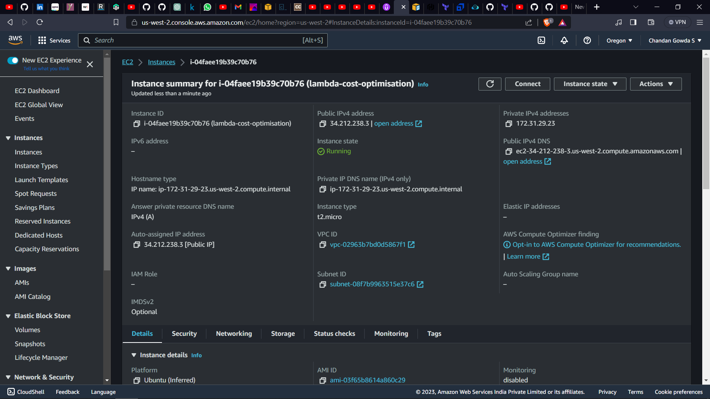

2. Check the Volume of Instance

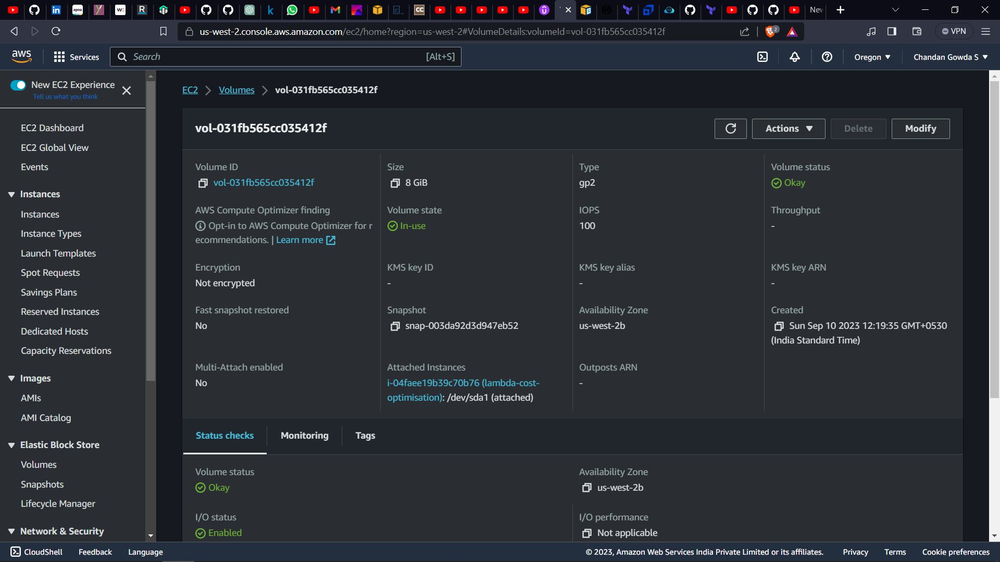

3. Create a Snpashot for Volume of EC2 instance created

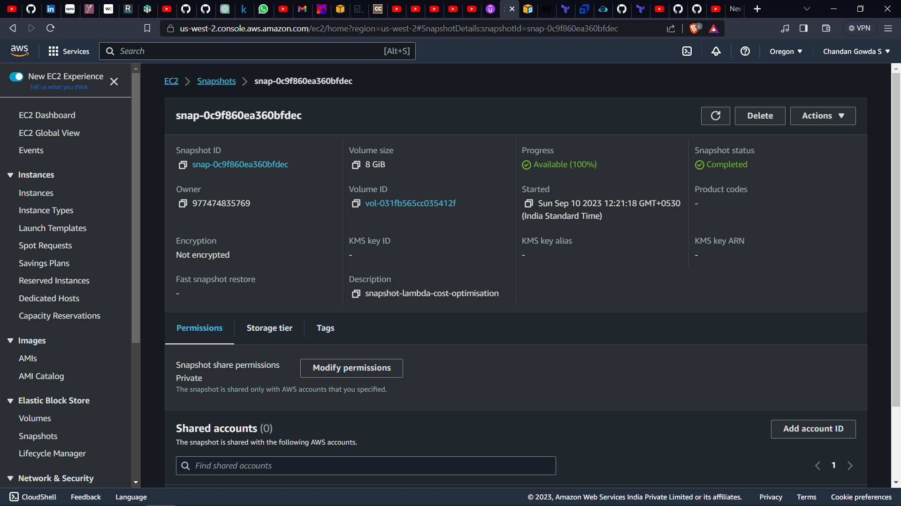

4. Created Lambda Function

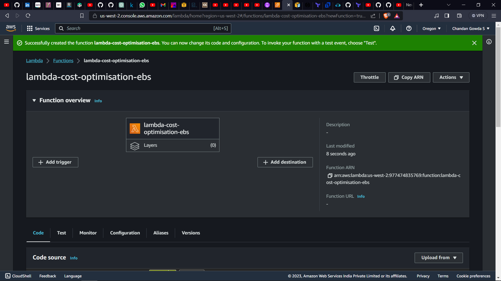

5. Timeout of test code increase to 5 seconds

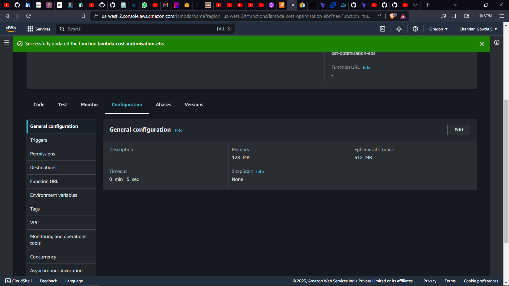

6. Created custom policy LIST_AND_DELETE_SNAPSHOT for giving access to lambda function to fetch the snapshot which is not associated to EC2 or EBS to delete it

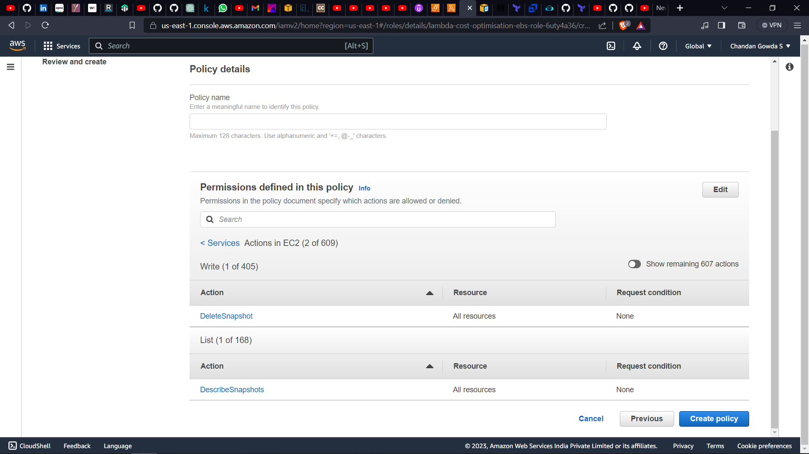

7. Attached two policies  to Lambda function which will fetch the snapshot and check whether it is associated to EC2 or EBS if it is not associated to EC2 or EBS it will delete the snapshot

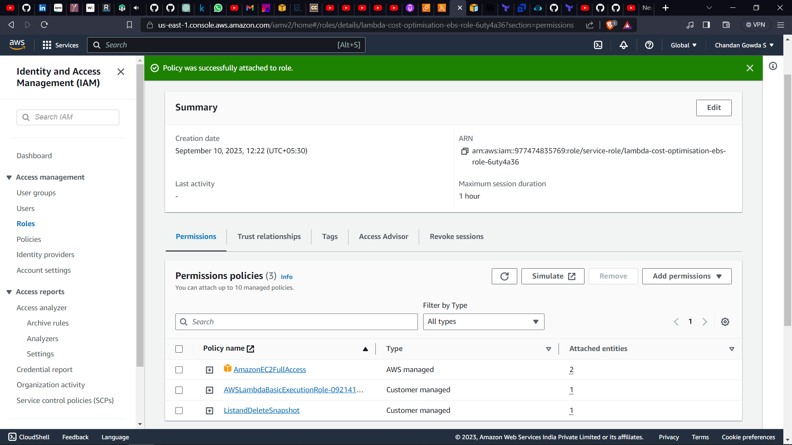

8. Test failed due to instance was running for that snapshot

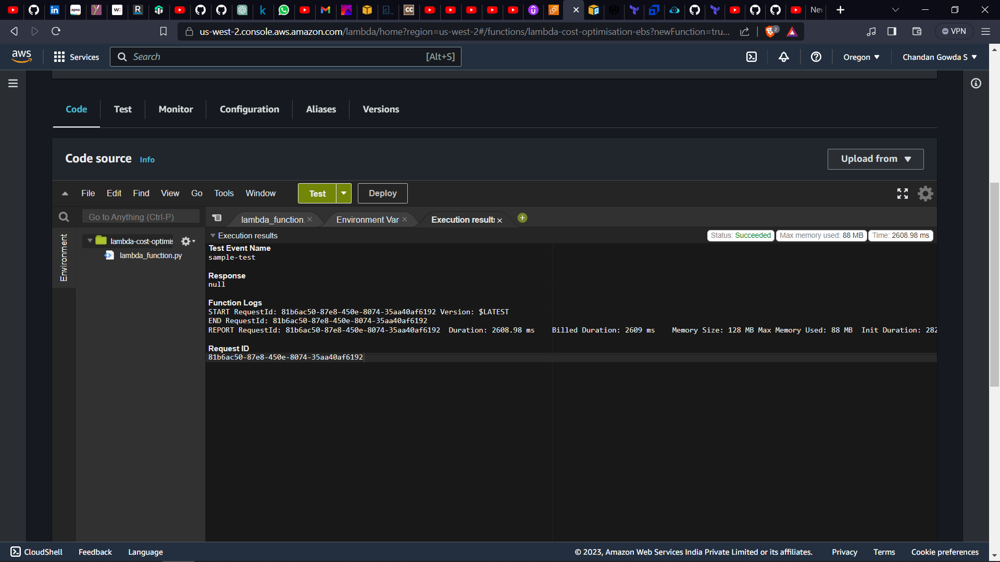

9. Instance terminated which was created at 1 step

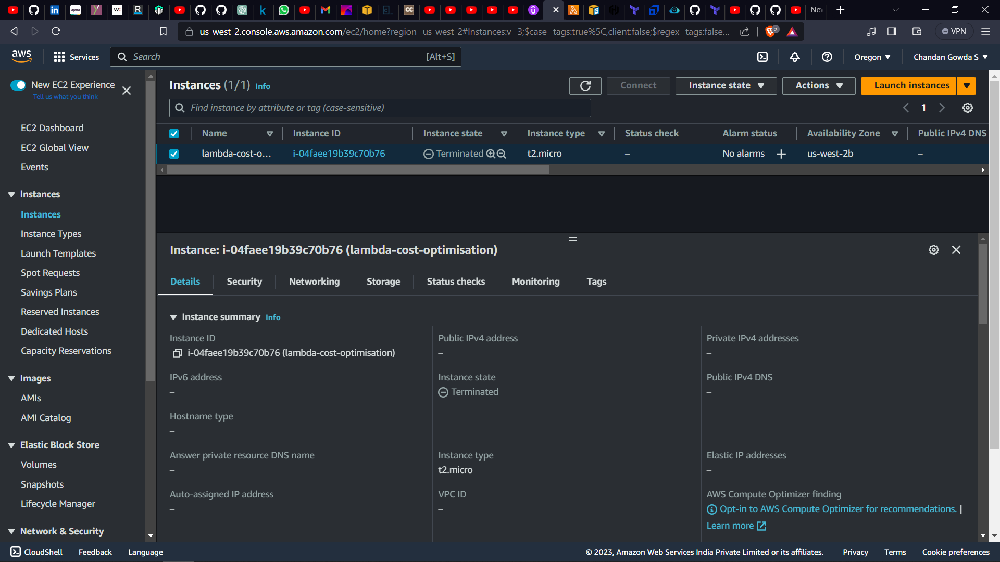

10. Only snapshot remained and rest resources such as EC2 and volume deleted

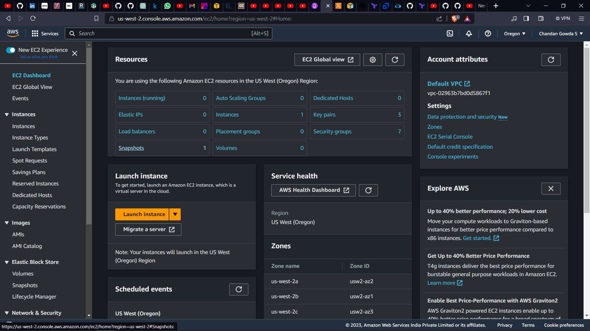

11. Test output that snapshot deleted because no EC2 nor any volume was attached to snapshot

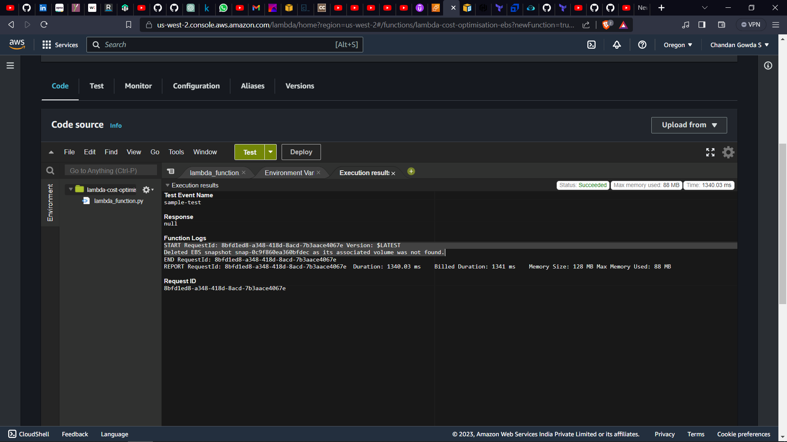

12. Output that Snapshot was deleted and can be seen that in dashboard

